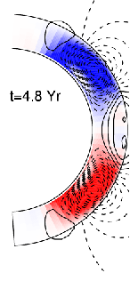

+++
title = "Dynamos"
url = "research-interests/dynamos"

[params]
	macros = [
		["\\Rm", "\\textrm{Rm}"],
		]
	bib = "global_refs.json"
+++

I find low-$\Rm$ mean-field modelling somewhat boring, and prefer to study systems where the small-scale dynamo is excited.

I have worked on the following topics:
- small-scale dynamo 
- large-scale dynamo 
- helicity fluxes 
