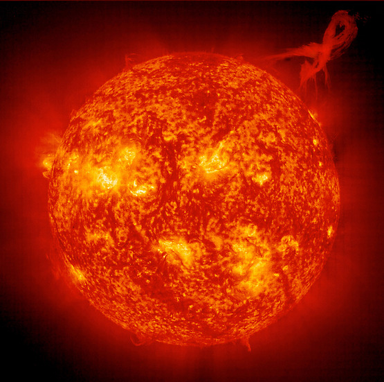

+++
title = "Solar physics"
url = "research-interests/solar-physics"

[params]
	bib = "global_refs.json"
+++

I have worked on the following topics:
- Surface magnetic fields 
- Helioseismology ([thesis](/blog/phd_thesis#part-6))
